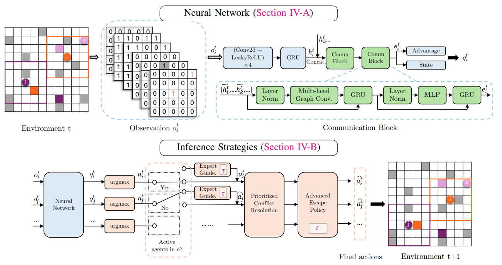

# EPH: Ensembling Prioritized Hybrid Policies for Multi-agent Pathfinding

[](https://arxiv.org/abs/2403.07559) <a href="https://colab.research.google.com/github/ai4co/eph-mapf/blob/main/quickstart.ipynb"></a>



## Usage

### Installation

[Optional] create a virtual environment:
```bash
conda create -n eph python=3.11
conda activate eph
```

Install the repo locally (with requirements listed in [pyproject.toml](pyproject.toml)):
```bash
pip install -e '.[all]'
```
Note: remove `[all]` if you don't want to install the optional dependencies.

### Configuration
To train and test we need to load the configuration file. under [configs/](configs/) you can find the default configuration file [eph.py](configs/eph.py). To change the configuration or create a new one, you can use export the "CONFIG" environment variable as the desired configuration name without the `.py` extension:
```bash
export CONFIG=eph
```

### Training
To train the model, you can use the following command:
```bash
python train.py
```


### Testing
To test the model, you can use the following command:
```bash
python test.py
```

#### Configurations
We made the configuration loading dynamic, so multiple configurations are allowed for different experiments under [configs/](configs/).

Before running _any_ script, you can change which configuration to load by changing the `CONFIG_NAME` variable in the [config.py](config.py) file:
```python
CONFIG_NAME = 'eph'
```
For example, the above will load the default configuration file [configs/eph.py](configs/eph.py).


#### Changing model
To change the model, we made sure that the model path is loaded from the configuration file.

You can change the target by:
```
model_target = "model.Network"
```

This will load the `Network` class from the `model.py` module.

## Data generation
Go to [src/data/](src/data/) and follow the instructions in the [README.md](src/data/README.md) for generating the MovingAI's test set.


### Acknowledgements

Our codebase is heavily based on DHC (https://github.com/ZiyuanMa/DHC) and DCC (https://github.com/ZiyuanMa/DCC). We used some inspiration from SCRIMP for our communication block (https://github.com/marmotlab/SCRIMP) and reimplemented structured maps experiments of MovingAI datasets from SACHA (https://github.com/Qiushi-Lin/SACHA).

We are also looking into implementing MAPF in some modern platform (i.e. TorchRL enviroments and integration with RL4CO) once we have some bandwidth to do so!

---


https://github.com/ai4co/eph-mapf/assets/48984123/9d3cd421-1460-4a2f-aaa4-11908c5b666c


---

### Citation

If you find our code or work (or hopefully both!) helpful, please consider citing us:

```bibtex
@article{tang2024eph,
  title={Ensembling Prioritized Hybrid Policies for Multi-agent Pathfinding},
  author={Tang, Huijie and Berto, Federico and Park, Jinkyoo},
  journal={arXiv preprint arXiv:2403.07559},
  year={2024}
}
```
